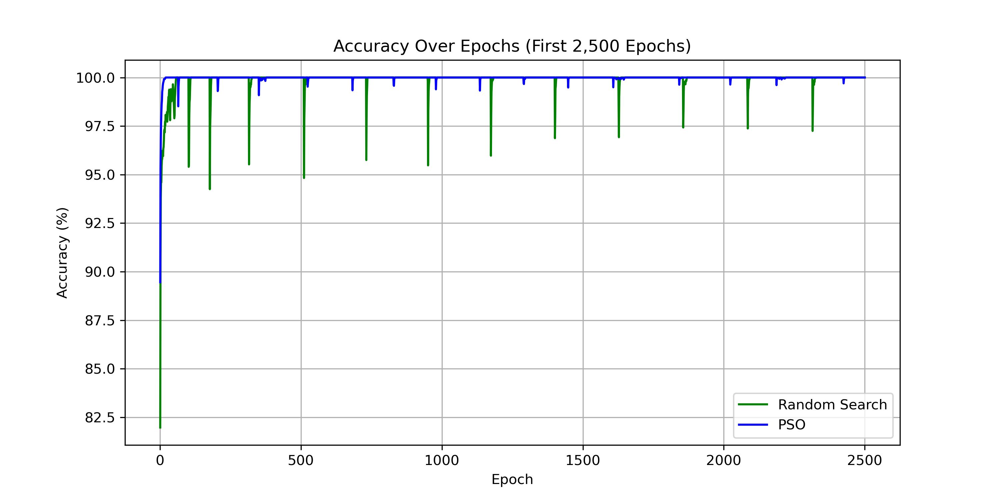

# 🔍 Neural Network Hyperparameter Optimization with PSO and Random Search

This project compares **Particle Swarm Optimization (PSO)** and **Random Search** for optimizing neural network hyperparameters (learning rate, batch size, hidden size). Implemented in PyTorch and benchmarked using a synthetic classification task, it explores the trade-off between exploration and exploitation phases under a fixed epoch budget.

---

## 🚀 Optimization Methods

| Method        | Exploration Budget | Exploitation Budget | Total Epochs |
|---------------|--------------------|----------------------|--------------|
| PSO           | 2,500              | 20,000               | 22,500       |
| Random Search | 5,000              | 15,000               | 20,000       |

Each trial used partial training (3 epochs) during the exploration phase to reduce compute cost.

---

## ✅ Results Summary

| Metric        | PSO               | Random Search        |
|---------------|------------------|----------------------|
| Best Accuracy | **100.00%**      | **100.00%**          |
| Best Config   | `lr=0.0020` `hidden=256` `batch=256` | `lr=0.0044` `hidden=117` `batch=32` |
| Time Taken    | ≈ 30 min / 500 epochs | ≈ 28 min / 500 epochs |

---

## 📈 Accuracy Comparison (Exploration Phase)

---

## 📊 Full Training Performance (Baseline Phase)

### 🔵 PSO - 2,500 + 20,000 Epochs

### 🟢 Random Search - 5,000 + 15,000 Epochs

---

## 🔁 Convergence Curves

### PSO Convergence (Top 10 Trials)

### Random Search Convergence

---

## 📁 Folder Structure

